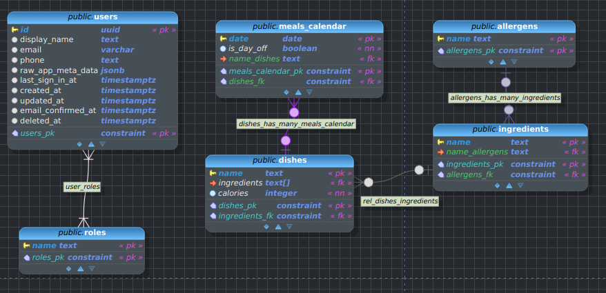

# Menu Scheduler Database Schema Documentation

## Overview

This document describes the database schema for the Menu Scheduler application. The database is built using PostgreSQL (via Supabase) and contains tables for managing users, roles, dishes, ingredients, allergens, meal calendars, and team organization.

## Tables

### Users (table managed by Supabase -- subset of fields below)

Stores user account information and authentication details.

- `id` (UUID, PK): Unique identifier, auto-generated
- `display_name` (text): User's display name
- `email` (varchar): User's email address
- `phone` (text): User's phone number
- `raw_app_meta_data` (jsonb): Application metadata
- `last_sign_in_at` (timestamptz): Last sign-in timestamp
- `created_at` (timestamptz): Account creation timestamp
- `updated_at` (timestamptz): Last update timestamp
- `email_confirmed_at` (timestamptz): Email confirmation timestamp
- `deleted_at` (timestamptz): Account deletion timestamp

### Roles

Defines user roles in the system.

- `name` (text, PK): Role name identifier

### Dishes

Contains information about available dishes.

- `name` (text, PK): Dish name identifier
- `ingredients` (text[], FK): Array of ingredients (FK) used in the dish
- `calories` (integer): Caloric content, defaults to 0

### Ingredients

Stores ingredient information with allergen relationships.

- `name` (text, PK): Ingredient name identifier
- `name_allergens` (text, FK): Reference to allergens

### Allergens

Lists possible allergens.

- `name` (text, PK): Allergen name identifier

### Meals Calendar

Tracks scheduled meals and off days.

- `date` (date, PK): Calendar date
- `is_day_off` (boolean): Indicates if it's a day off, defaults to false
- `name_dishes` (text, FK): Reference to scheduled dish

### Teams

Manages team organization.

- `team_id` (UUID, PK): Unique team identifier, auto-generated
- `name` (text): Team name
- `date_meals_calendar` (date, FK): Reference to meals calendar

### Members

Manages team membership and roles.

- `member_id` (UUID, PK): Unique member identifier, auto-generated
- `is_manager` (boolean): Indicates if member is a manager, defaults to false
- `team_id_teams` (UUID, FK): Reference to team
- `id_users` (UUID, FK): Reference to user

## Cross-Reference Tables

### many_roles_has_many_users

Maps the many-to-many relationship between roles and users.

- `name_roles` (text, PK, FK): Reference to role
- `id_users` (UUID, PK, FK): Reference to user

## Custom Types

### roles_enum

Enumerated type for role values:

- `admin`
- `user`

## Key Relationships

1. Ingredients → Allergens: Each ingredient can be associated with an allergen
2. Meals Calendar → Dishes: Each calendar entry can reference a specific dish
3. Teams → Meals Calendar: Teams can be associated with specific calendar dates
4. Members → Teams: Members belong to teams
5. Members → Users: Members are linked to user accounts
6. Users ↔ Roles: Many-to-many relationship through cross-reference table

## Notes

- The database uses UUID for most entity identifiers
- Timestamps are stored in timestamptz format for proper timezone handling
- Team members can be designated as managers through the `is_manager` boolean flag
- Calendar entries can be marked as off days using the `is_day_off` flag
